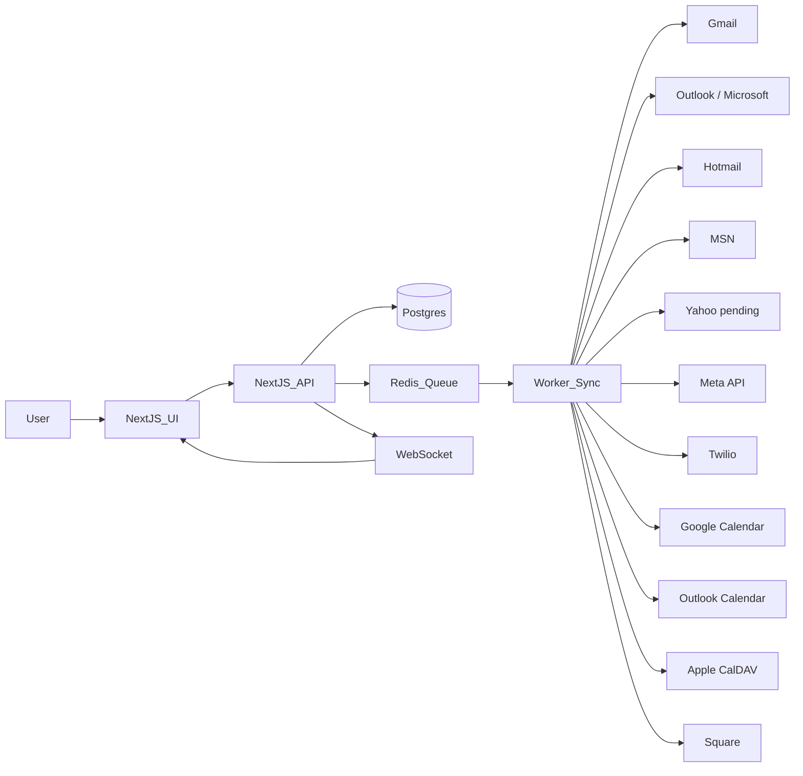

# Enterprise Launch Readiness (Phase 0)

## Production environment variables (Vercel)

Confirm these are set in the Vercel project (Settings → Environment Variables) for Production:

### Database
- `DATABASE_URL` – PostgreSQL connection string (Supabase or other). Run migrations in prod: `npx prisma migrate deploy`.

### Auth & app
- `NEXTAUTH_URL` – Production app URL (e.g. `https://your-app.vercel.app`)
- `NEXTAUTH_SECRET` – Strong secret for NextAuth
- `JWT_SECRET` or `NEXTAUTH_SECRET` – For WebSocket token signing

### Inbox / messaging
- **Gmail:** `GOOGLE_CLIENT_ID`, `GOOGLE_CLIENT_SECRET`
- **Outlook:** `OUTLOOK_CLIENT_ID`, `OUTLOOK_CLIENT_SECRET`, `OUTLOOK_REDIRECT_URI`
- **Meta (Facebook/Instagram):** `FACEBOOK_APP_ID`, `FACEBOOK_APP_SECRET`, `FACEBOOK_WEBHOOK_VERIFY_TOKEN`
- **X (Twitter):** `TWITTER_API_KEY`, `TWITTER_API_SECRET`, `TWITTER_OAUTH_CALLBACK`
- **SMS (Twilio):** `TWILIO_ACCOUNT_SID`, `TWILIO_AUTH_TOKEN`, `TWILIO_PHONE_NUMBER`

### Background worker (queue + cron)
- **Upstash Redis:** `UPSTASH_REDIS_REST_URL`, `UPSTASH_REDIS_REST_TOKEN` (used by Ratelimit and optional BullMQ)
- **Optional (BullMQ):** `REDIS_URL` or `REDIS_HOST` + `REDIS_PORT` + `REDIS_PASSWORD` for sync queue

### Calendar
- Google Calendar uses same OAuth as Gmail. Outlook calendar uses Outlook OAuth. Apple (CalDAV) and Square use their own credentials per integration.

### Monitoring
- `SENTRY_DSN` – For error tracking (optional but recommended)

### Migrations in production
After setting `DATABASE_URL` in Vercel, run migrations from a machine that can reach the DB:
```bash
cd tatu-app && npx prisma migrate deploy
```

## Background worker layer

- **Vercel Cron** is configured in `vercel.json`:
  - `/api/cron/sync-messages` – every 15 minutes
  - `/api/cron/sync-calendars` – every 30 minutes
  - `/api/cron/appointment-reminders` – daily at 9:00
- **Queue:** Sync routes use `addSyncJob()` from `lib/bullmq-jobs.ts` to enqueue work when Redis is available; otherwise they run inline when the cron hits the route.
- **Retry:** Sync jobs use BullMQ default retries with exponential backoff when the queue is used.

## Architecture snapshot (updated)



## Current launch to-do list

- [ ] Implement Yahoo inbox connect/sync/reply flow (app password or OAuth)
- [ ] Set missing production env vars (Stripe, Meta, Twilio, Twitter, Upstash, Sentry, S3, OpenAI)
- [ ] Validate Hotmail/MSN connect path and end-to-end message sync/send
- [ ] Add integration and e2e tests for Outlook aliases + Yahoo flow
